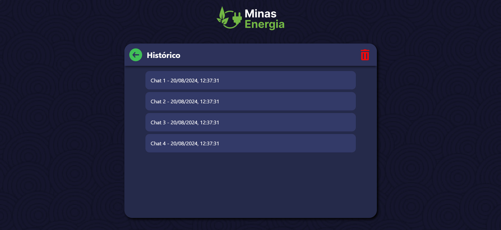
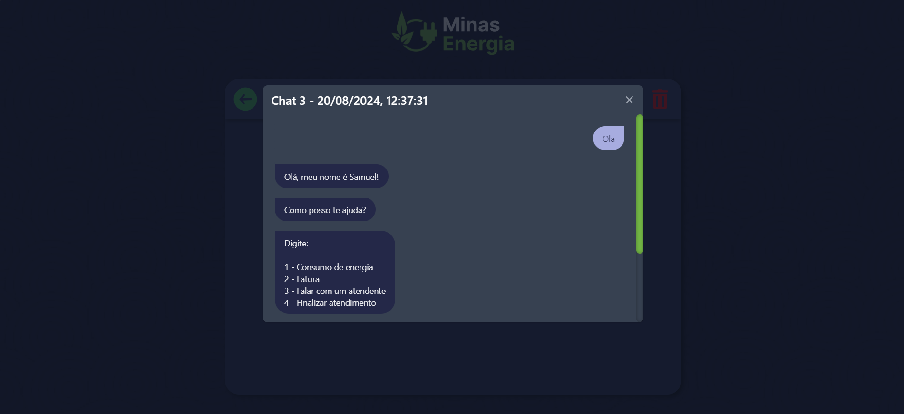

# C115 - Trabalho 1 - Chatbot

Esse projeto é um Chatbot simples para uma empresa de distribuição de energia fictícia, chamada de Minas Energia.

Ele conta com a funcionalidade de responder algumas perguntas pré-setadas e armazena o histórico de todos os chats.

Foi utilizado:
- Python, Flask e SocketIO para o backend
- HTML, CSS, Tailwind CSS, Jinja2 e Java Script para o frontend
- SQLite para a base de dados

### Chatbot


### Histórico


### Mensagens


## Instalação

Caso ainda não possua, faça a instalação do [Python 3.12.1](https://www.python.org/downloads/release/python-3121/) para que o projeto funcione corretamente!

Faça o clone do repositório:

```bash
git clone https://github.com/ArthurBuenoSilva/C115-Trabalho-1-Chatbot.git
```

Acesse a pasta onde você clonou o repositório:

```bash
cd caminho\para\o\projeto
```

Crie um ambiente virtual(venv):

```bash
python -m venv venv
```

## Uso

Acesse o ambiente virtual criado:

```bash
venv/Scripts/activate
```

Agora execute o script main.py:

```bash
python main.py
```

No terminal deve aparecer uma mensagem parecida com essa:

```bash
 * Serving Flask app 'app'
 * Debug mode: off
WARNING: This is a development server. Do not use it in a production deployment. Use a production WSGI server instead.
 * Running on http://127.0.0.1:49675
Press CTRL+C to quit
```

Agora que o servidor já está em execução é só acessar a url que aparecer no terminal.

No meu caso eu deveria acessar a url http://127.0.0.1:49675.

## Contribuições

Solicitações de pull requests são bem-vindas. Para mudanças importantes, abra uma issue primeiro para discutir o que você gostaria de mudar.

## Licença

[MIT](https://choosealicense.com/licenses/mit/)